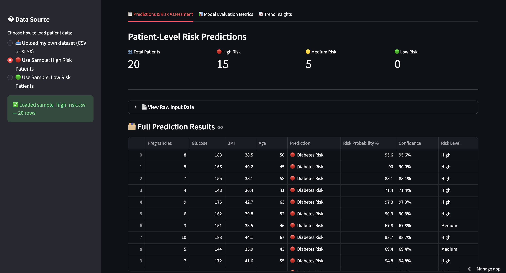
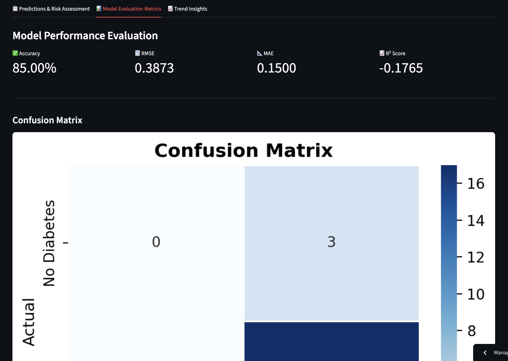
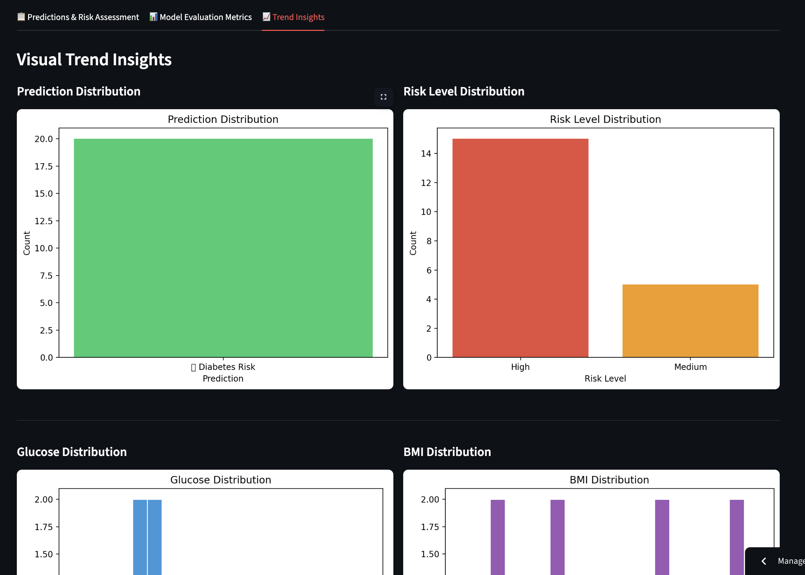
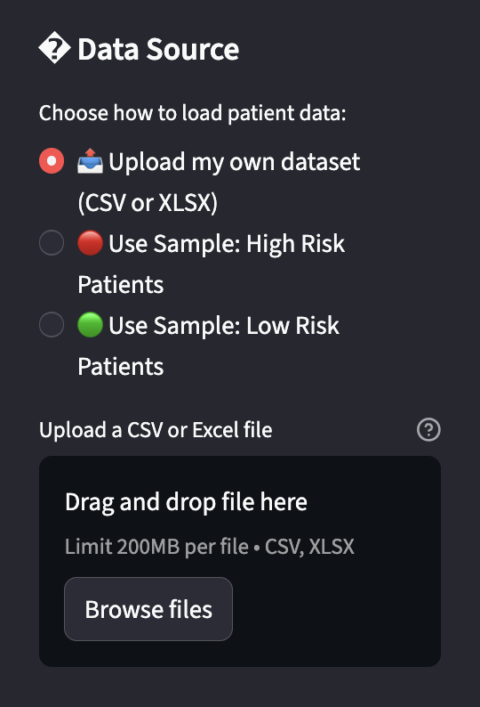
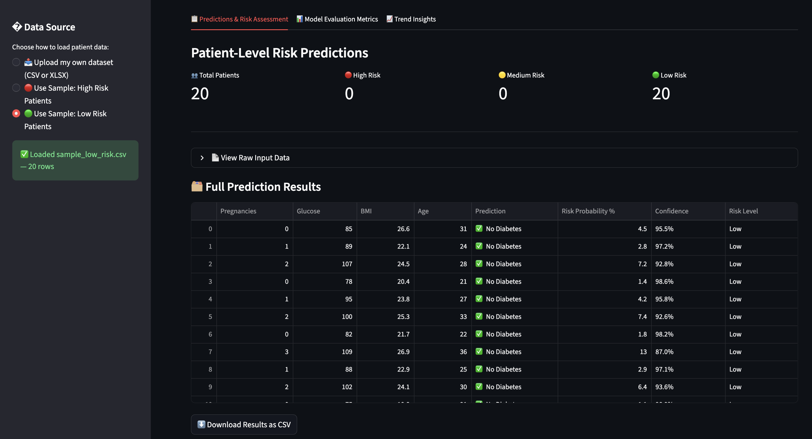

# 🏥 Intelligent Patient Risk Assessment System

<div align="center">


**A machine learning–powered web application for diabetes risk prediction**

[🌐 Live Demo](https://patient-risk-assessment-pngmjqymiun8h3fvblgek7.streamlit.app/) • [📁 GitHub Repo](https://github.com/nishantvatssharma4115/patient-risk-assessment) • [📄 Report](#)

---

*Developed for **Intro to Gen AI** · NST Sonipat · Milestone 1*

</div>

---

## 📌 Overview

The **Intelligent Patient Risk Assessment System** is an end-to-end machine learning web application that predicts whether a patient is at risk of developing diabetes based on eight key clinical measurements. Built with Streamlit and Scikit-Learn, it provides instant probability-based risk assessments through an intuitive three-tab interface.

Users can either **upload their own patient dataset** (CSV or Excel) or use one of two **pre-built sample datasets** to explore the system immediately — no technical knowledge required.

> ⚠️ **Disclaimer:** This tool is for educational purposes only and is not a substitute for professional medical advice.

---

## 🌐 Live Demo

🔗 **[https://patient-risk-assessment-pngmjqymiun8h3fvblgek7.streamlit.app/](https://patient-risk-assessment-pngmjqymiun8h3fvblgek7.streamlit.app/)**

---

## 🖼️ Screenshots

### Tab 1 — Predictions & Risk Assessment


### Tab 2 — Model Evaluation Metrics


### Tab 3 — Trend Insights


### Upload Feature


### Low Risk Predictions


---

## ✨ Features

| Feature | Description |
|---|---|
| 📤 **Dataset Upload** | Upload your own CSV or Excel file with patient data |
| 🔴 **High Risk Sample** | Built-in dataset of 20 high-risk patients for instant demo |
| 🟢 **Low Risk Sample** | Built-in dataset of 20 low-risk patients for instant demo |
| 📊 **Risk Prediction** | Per-patient prediction: Diabetes Risk / No Diabetes |
| 🎯 **Risk Levels** | Patients classified as High / Medium / Low risk |
| 📈 **Evaluation Metrics** | Accuracy, RMSE, MAE, R² Score + Confusion Matrix |
| 📉 **Trend Insights** | 5 interactive charts: distributions, histograms, correlation heatmap |
| ⬇️ **Download Results** | Export full prediction results as a CSV file |

---

## 🛠️ Tech Stack

| Technology | Version | Purpose |
|---|---|---|
| Python | 3.9+ | Core programming language |
| Streamlit | ≥ 1.32.0 | Web application UI — all tabs, charts, file uploader |
| Scikit-Learn | ≥ 1.4.0 | Logistic Regression model, StandardScaler, evaluation metrics |
| Pandas | ≥ 2.2.0 | Data loading, zero-imputation, results table construction |
| NumPy | ≥ 1.26.0 | Array operations and RMSE computation |
| Matplotlib | ≥ 3.8.0 | Chart rendering canvases |
| Seaborn | ≥ 0.13.0 | Confusion matrix and correlation heatmap |
| Joblib | ≥ 1.3.0 | Saving and loading `model.pkl` and `scaler.pkl` |
| Openpyxl | ≥ 3.1.0 | Reading `.xlsx` files uploaded by users |

---

## 📂 Dataset

The **Pima Indians Diabetes Dataset** was originally collected by the National Institute of Diabetes and Digestive and Kidney Diseases (NIDDK), USA. It is a standard ML benchmark dataset available on Kaggle and the UCI Repository.

| Attribute | Detail |
|---|---|
| Total Records | 768 patients |
| Input Features | 8 numeric clinical measurements |
| Target Variable | `Outcome` — binary (0 = No Diabetes, 1 = Diabetes) |
| Class Distribution | 500 No Diabetes (65.1%) · 268 Diabetes (34.9%) |

| # | Feature | Description |
|---|---|---|
| 1 | `Pregnancies` | Number of times pregnant |
| 2 | `Glucose` | Plasma glucose concentration (mg/dL) |
| 3 | `BloodPressure` | Diastolic blood pressure (mm Hg) |
| 4 | `SkinThickness` | Triceps skinfold thickness (mm) |
| 5 | `Insulin` | 2-hour serum insulin (µU/mL) |
| 6 | `BMI` | Body mass index (kg/m²) |
| 7 | `DiabetesPedigreeFunction` | Diabetes likelihood based on family history |
| 8 | `Age` | Patient age in years |

---

## 📁 Project Structure

```
patient-risk-assessment/
│
├── src/
│   ├── app.py              ← Streamlit UI: sidebar, 3 tabs, charts, download
│   ├── model.py            ← Logistic Regression training, evaluation, predict_risk()
│   └── preprocess.py       ← Data cleaning, StandardScaler, train/test split
│
├── data/
│   ├── diabetes.csv                ← Pima Indians training dataset
│   ├── sample_high_risk.csv        ← 20 pre-built high-risk patient records
│   └── sample_low_risk.csv         ← 20 pre-built low-risk patient records
│
├── models/
│   ├── model.pkl           ← Saved trained Logistic Regression model
│   └── scaler.pkl          ← Saved fitted StandardScaler
│
├── assets/
│   └── screenshots/        ← App screenshots (used in this README)
│
├── requirements.txt        ← All Python dependencies with version pins
└── README.md               ← This file
```

---

## 🚀 How to Run Locally

### Prerequisites
- Python 3.9 or higher
- `git` installed

### Step-by-step

**1. Clone the repository**
```bash
git clone https://github.com/nishantvatssharma4115/patient-risk-assessment.git
cd patient-risk-assessment
```

**2. Create and activate a virtual environment**
```bash
python3 -m venv venv
source venv/bin/activate        # macOS / Linux
# venv\Scripts\activate         # Windows
```

**3. Install all dependencies**
```bash
pip install -r requirements.txt
```

**4. Train and save the ML model**
```bash
python src/model.py
```
This generates `models/model.pkl` and `models/scaler.pkl` automatically.

**5. Launch the Streamlit app**
```bash
streamlit run src/app.py
```

The app will open at **http://localhost:8501**

---

## 🧠 ML Methodology

### Data Preprocessing
The raw dataset contains biologically impossible zero values in `Glucose`, `BloodPressure`, `SkinThickness`, `Insulin`, and `BMI` — these represent missing measurements recorded as zeros. All such zeros are replaced with `NaN` and imputed using the **column median** (preferred over mean due to robustness against outliers). Features are then standardised using `StandardScaler` (zero mean, unit variance) to prevent large-scale features like Insulin from dominating the model. The dataset is split **80% training / 20% testing** with `random_state=42` for full reproducibility.

### Model — Logistic Regression
Logistic Regression was selected for the following reasons:
- Well-suited to **binary classification** (diabetic / non-diabetic)
- Produces **calibrated probability outputs** — powering the risk percentage display
- Highly **interpretable** — coefficients can be explained in plain English to stakeholders
- Strong baseline before exploring complex models (Random Forest, XGBoost)

### Results

| Metric | Value |
|---|---|
| Accuracy | **75.32%** |
| Precision (Diabetes) | 0.67 |
| Recall (Diabetes) | 0.62 |
| F1-Score | 0.64 |
| RMSE | ~0.497 |
| MAE | ~0.247 |
| R² Score | ~0.01 |

### Confusion Matrix

|  | Predicted: No Diabetes | Predicted: Diabetes |
|---|---|---|
| **Actual: No Diabetes** | 82 ✅ (True Negative) | 17 ⚠️ (False Positive) |
| **Actual: Diabetes** | 21 ❌ (False Negative) | 34 ✅ (True Positive) |

> The 21 False Negatives (missed diagnoses) are the most consequential errors in a healthcare context — which is why **Recall** is prioritised alongside Accuracy.

---

## 🖥️ App Walkthrough

### Sidebar — Data Source
Choose one of three options:
- 📤 Upload your own CSV or Excel patient dataset
- 🔴 Use the built-in High Risk sample (20 patients)
- 🟢 Use the built-in Low Risk sample (20 patients)

### Tab 1 — Predictions & Risk Assessment
- Summary cards: Total Patients · High Risk · Medium Risk · Low Risk
- Full results table with Prediction, Risk Probability %, Confidence, Risk Level
- Raw input data expander
- Download results as CSV

### Tab 2 — Model Evaluation Metrics
*(Available when uploaded data includes an `Outcome` column)*
- Accuracy, RMSE, MAE, R² Score metric cards
- Annotated Confusion Matrix heatmap
- Plain-English explanation of each metric

### Tab 3 — Trend Insights
- Prediction Distribution bar chart
- Risk Level Distribution bar chart
- Glucose value histogram
- BMI value histogram
- Full-width Feature Correlation Heatmap

---

## 👥 Team

| Name | Enrollment No. | Role | Key Contributions |
|---|---|---|---|
| Nishant Sharma | 2401010302 | Data Engineering, Deployment & GitHub | Data preprocessing (`preprocess.py`), zero-imputation, StandardScaler, sample datasets, GitHub repository setup & management, Streamlit Cloud deployment |
| Dev Tyagi | 2401010148 | ML Model Development & Evaluation | Model training (`model.py`), Logistic Regression, all evaluation metrics (Accuracy, Precision, Recall, F1, RMSE, MAE, R²), `evaluate_dataset()` function |
| Karan Chhillar | 2401010211 | UI Design & Frontend Development | Streamlit interface (`app.py`), all 3 tabs, sidebar, charts, download button, error handling, responsive layout |

**Course:** Intro to Gen AI · NST Sonipat
**Instructor:** Bipul Shahi

---

## 📄 License

This project is licensed under the [MIT License](LICENSE).

---

<div align="center">

Made with ❤️ for Intro to Gen AI · NST Sonipat

⭐ If you found this useful, consider starring the repository!

</div>